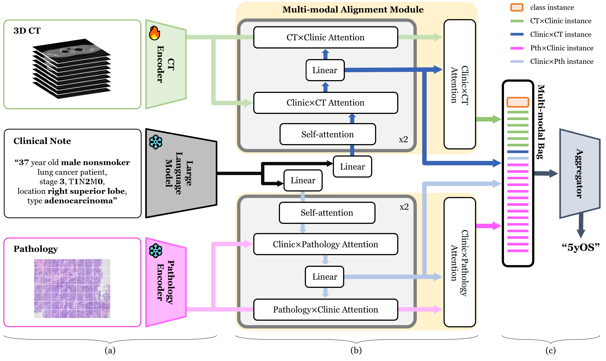

<div align="center">

# LLM-Guided Multi-modal MIL

### LLM-Guided Multi-modal Multiple Instance Learning for<br>5-Year Overall Survival Prediction of Lung Cancer

<p>
    <a href="https://doi.org/10.1007/978-3-031-72384-1_23"></a>&nbsp;
    <a href="https://github.com/KyleKWKim/LLM-guided-Multimodal-MIL"></a>
</p>

**MICCAI 2024** &nbsp;|&nbsp; Kyungwon Kim · Yongmoon Lee · Doohyun Park · Taejoon Eo · Daemyung Youn · Hyesang Lee · Dosik Hwang

<p>
  
</p>

</div>

## 📄 Abstract

Accurately predicting the 5-year prognosis of lung cancer patients is crucial for guiding treatment planning and providing optimal patient care. Traditional methods relying on CT image-based cancer stage assessment and morphological analysis of cancer cells in pathology images have encountered challenges in terms of reliability and accuracy due to the complexity and diversity of information within these images.
Recent rapid advancements in deep learning have shown promising performance in prognosis prediction, however utilizing CT and pathology images independently is limited by their differing imaging characteristics and the unique prognostic information. To effectively address these challenges, this study proposes a novel framework that integrates prognostic capabilities of both CT and pathology images with clinical information, employing a multi-modal integration approach via multiple instance learning, leveraging large language models (LLMs) to analyze clinical notes and align them with image modalities. The proposed approach was rigorously validated using external datasets from different hospitals, demonstrating superior performance over models reliant on vision or clinical data alone. This highlights the adaptability and strength of LLMs in managing complex multi-modal medical datasets for lung cancer prognosis, marking a significant advance towards more accurate and comprehensive patient care strategies.

## ✨ Highlights

- **Multi-modal Integration** — Synergistic combination of CT images, pathology images, and clinical information via multiple instance learning for comprehensive lung cancer prognosis.
- **LLM-Guided Alignment** — Leverages pretrained text encoders to analyze clinical notes and align textual semantics with imaging modalities through cross-attention.
- **External Validation** — Rigorously validated on external datasets from different hospitals, demonstrating superior generalizability over single-modality baselines.

## 📂 Dataset

You can request the full dataset at [AI-Hub](https://www.aihub.or.kr/aihubdata/data/view.do?currMenu=115&topMenu=100&dataSetSn=71394).

## 📌 Citation

If you find this work useful, please consider citing:

```bibtex
@inproceedings{kim2024llmguided,
      title={LLM-Guided Multi-modal Multiple Instance Learning for 5-Year Overall Survival Prediction of Lung Cancer},
      author={Kim, Kyungwon and Lee, Yongmoon and Park, Doohyun and Eo, Taejoon and Youn, Daemyung and Lee, Hyesang and Hwang, Dosik},
      booktitle={Medical Image Computing and Computer Assisted Intervention -- MICCAI 2024},
      pages={239--249},
      year={2024},
      publisher={Springer},
      doi={10.1007/978-3-031-72384-1_23}
}
```
